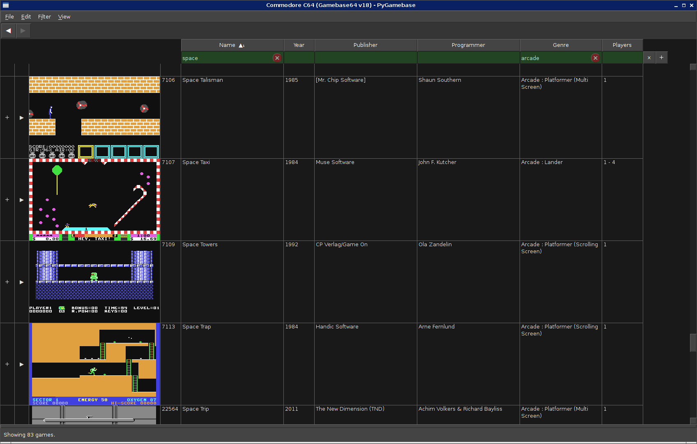
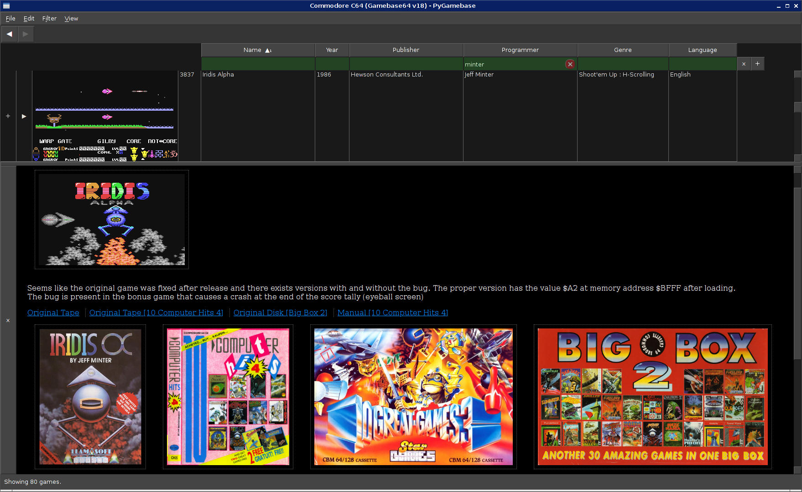
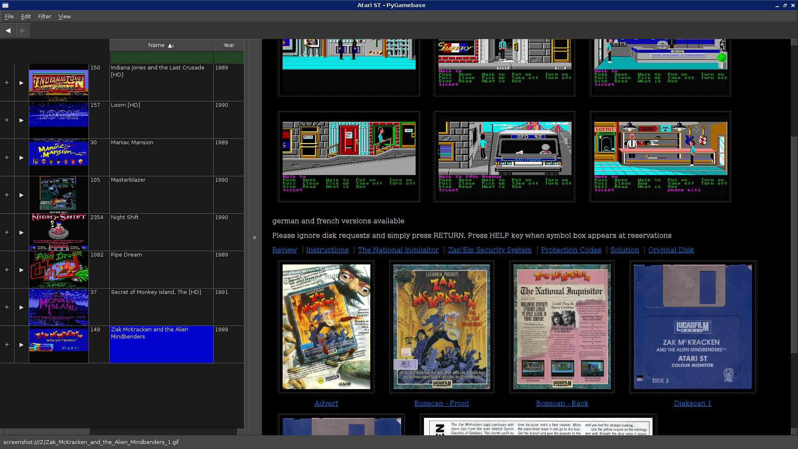
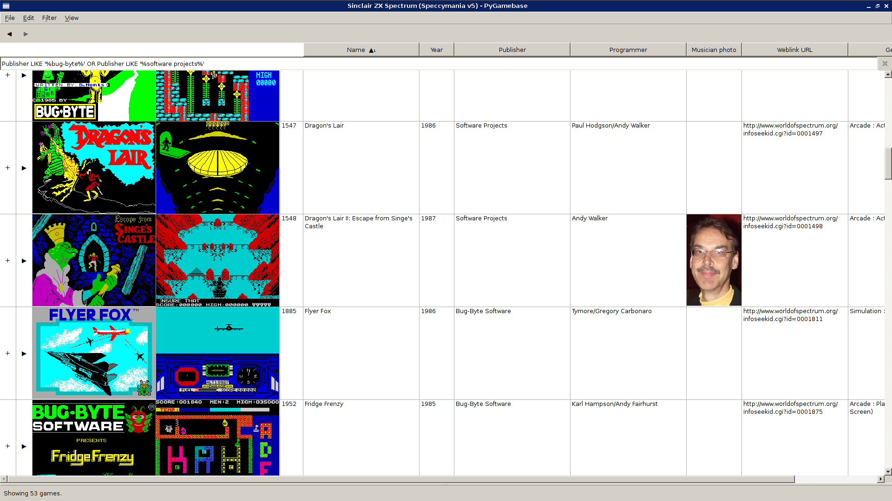

_PyGamebase_ is a frontend and launcher for ['Gamebase'](https://www.bu22.com/) game collections.

It is written and scripted in Python, has a user interface built on Qt, and works with Gamebase databases in SQLite format. It is intended to work on any platform that supports these dependencies (eg. Windows, Mac, Linux).

# Getting the program and its dependencies

There are no packaged releases yet; just get the files by either cloning the repository or downloading a ZIP via GitHub's 'Code' button.

The frontend and helper programs are written in Python 3 with an external library dependency on [PySide2](https://pypi.org/project/PySide2/). Typically, you would install this library with your operating system's package manager, or with the Python-specific command `pip install PySide2`.

# Next steps

See the [converter](converter) directory for help to convert existing Gamebase databases (in Microsoft Access .mdb format) to SQLite, and do other Gamebase preparation steps.

See the [frontend](frontend) directory for the program proper.
